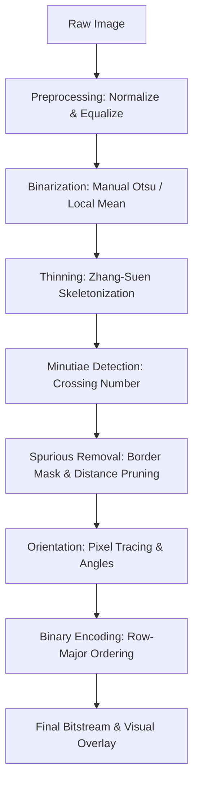

# Implementation Plan: Fingerprint Minutiae-to-Bitstream Pipeline

This plan outlines the implementation of the first stage of the "Secure Hardware IP Design Protection Using Post-Quantum Framework" pipeline. It describes the design of each modular Python step and the algorithmic equations implemented from scratch without external fingerprint-specific libraries.

## Pipeline Architecture & Modules

---

## 1. Preprocessing (`preprocessing.py`)
- **Intensity Normalization**: Scale pixel intensities linearly to standard $[0, 255]$ range, or normalize to a specified mean and variance:
  $$I_{norm}(x,y) = \mu_{new} + \text{sgn}(I(x,y) - \mu) \cdot \sqrt{\frac{\sigma^2_{new} \cdot (I(x,y) - \mu)^2}{\sigma^2}}$$
- **Histogram Equalization**: Map cumulative distribution function (CDF) of pixel intensities to uniform:
  $$h(v) = \text{round}\left(\frac{CDF(v) - CDF_{min}}{(W \times H) - CDF_{min}} \times 255\right)$$
- **Manual Binarization**:
  - **Manually Implemented Otsu's Method**: Maximize between-class variance $\sigma_B^2(t)$:
    $$\sigma_B^2(t) = \omega_0(t)\omega_1(t)[\mu_0(t) - \mu_1(t)]^2$$
    Iterate $t \in [0, 255]$ to choose the threshold $T$ that maximizes this variance.
  - **Local Adaptive Thresholding**: Compute mean in a local window $W \times W$ centered at $(x,y)$. Binarize as:
    $$B(x,y) = \begin{cases} 1 & \text{if } I_{equalized}(x,y) < Mean_{local}(x,y) - C \\ 0 & \text{otherwise} \end{cases}$$
    (where $C$ is a constant, and $1$ represents ridges and $0$ background/valleys).

---

## 2. Zhang-Suen Thinning (`thinning.py`)
Implement the 2-subiteration parallel thinning algorithm from scratch.
- Let the eight neighbors of $P_1$ in circular order be:
  $$P_2(N), P_3(NE), P_4(E), P_5(SE), P_6(S), P_7(SW), P_8(W), P_9(NW)$$
- **Sub-iteration 1**: A pixel $P_1 = 1$ is marked for deletion if:
  1. $2 \le B(P_1) \le 6$ (where $B(P_1) = \sum_{i=2}^9 P_i$).
  2. $A(P_1) = 1$ (transition count $0 \to 1$ in $P_2, P_3, ..., P_9, P_2$).
  3. $P_2 \cdot P_4 \cdot P_6 = 0$.
  4. $P_4 \cdot P_6 \cdot P_8 = 0$.
- **Sub-iteration 2**: Similar to sub-iteration 1, but conditions 3 and 4 are:
  3. $P_2 \cdot P_4 \cdot P_8 = 0$.
  4. $P_2 \cdot P_6 \cdot P_8 = 0$.
- Repeat both sub-iterations until no more pixels can be deleted.

---

## 3. Minutiae Detection (`minutiae.py`)
- **Crossing Number (CN) Method**: For each skeleton pixel $P_1 = 1$:
  $$CN = 0.5 \sum_{i=2}^9 |P_i - P_{i+1}| \quad \text{with } P_{10} = P_2$$
- Classify minutiae based on $CN$:
  - $CN = 1 \implies$ **Ridge Ending** (type index 1)
  - $CN = 3 \implies$ **Ridge Bifurcation** (type index 3)
  - $CN = 2 \implies$ Normal ridge pixel (ignored)
  - $CN = 4 \implies$ Intersection (ignored)

---

## 4. Spurious Minutiae Removal (`minutiae.py`)
- **Border Discarding**:
  - Build a foreground mask by finding the convex hull of active ridge points.
  - Fill the convex hull and erode it using standard binary erosion to exclude the marginal areas.
  - Discard any minutia that falls outside the eroded mask.
- **Distance Pruning**:
  - For any pairs of minutiae $(m_i, m_j)$ that lie within Euclidean distance $d(m_i, m_j) < D_{min}$, discard them. This eliminates false endings/bifurcations caused by skeleton noise/spurs.

---

## 5. Local Ridge Orientation Angle (`minutiae.py`)
- For each surviving minutia at $(r, c)$, trace skeleton pixels inside a local window (e.g. 9x9):
  - **Ending**: Trace the single connected path of skeleton pixels starting from the minutia up to $L$ steps.
  - **Bifurcation**: Trace all 3 connected paths starting from the minutia.
- For each path, compute the Cartesian direction vector from the start $(c, -r)$ to the trace end point:
  $$\vec{v} = (c_{end} - c_{start}, r_{start} - r_{end})$$
  $$\theta = \text{atan2}(dy, dx) \pmod{2\pi}$$
- **Resolve Angling**:
  - **Ending**: The angle is direct.
  - **Bifurcation**: Identify the pair of branches with the smallest angular separation (the fork). The remaining branch is the "trunk". The bifurcation orientation is oriented along this trunk direction $\theta_{trunk}$.
- Convert angles to degrees and round to integers.

---

## 6. Binary Encoding & Bitstream (`encoding.py` & `main.py`)
- Concatenate variables using '-' separator in order:
  $$\text{Code} = \{x\}_{bin} - \{y\}_{bin} - \{\text{type}\}_{bin} - \{\text{angle}\}_{bin}$$
  where minimal-width binary uses Python's `bin(val)[2:]`.
- Sort all minutiae in row-major order: sort by row $y$ (top-to-bottom), then by column $x$ (left-to-right).
- Concatenate all individual codes into a single continuous sequence of `0`s and `1`s (removing the `-` separators).
- Compile a tabular output and compute diagnostic stats (#0s, #1s, bit count).
